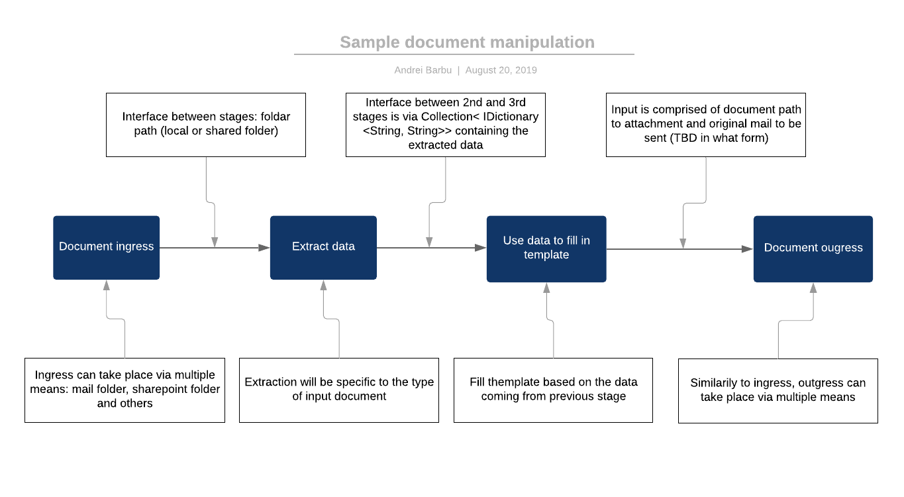
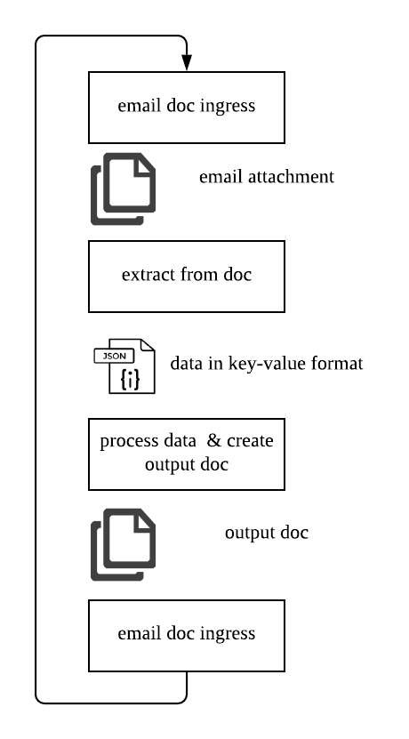
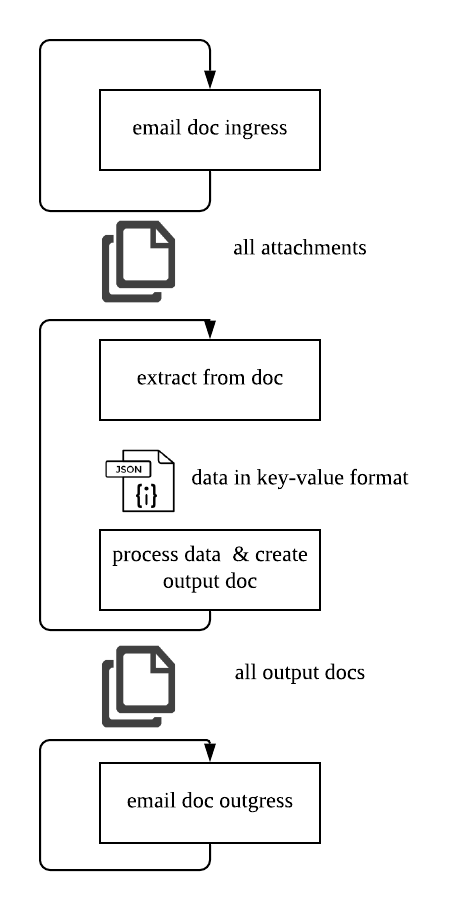

# Template document manipulation project

A sample project showcasing the UiPath implementation of a hypotetical scenario: agents fill client information into template excel files. These files are either sent via email to a specified address, or they are uploaded to a sharepoint site. These files are then processed in the backoffice:
1. the excel files are opened and relevant data is extracted
2. Some of the fields are used to fill in a template document
3. The document is saved as a pdf and sent via email to an email address provided in the input excel file

## Purpose

This template aims at providing examples of using config dictionaries, interfaces between stages to allow for interchangeable workflows adhering to interfacing convention.  

## Architecture

The project contains these distinct phases:
1. Ingress of documents, saving them locally for further processing, using a range of options:
    - email account
    - sharepoint folder
2. Extraction of data from the input files, using the folder where the files were saved as source
3. Using the extracted data to fill in templates and save them in the local outgress folder
4. Ougress documents using one of the possible options 

## Implementation scenarios

### Single loop

The single loop approach creates a single loop, which takes the attachments from the ingress email, downloads them, processes and then outgresses the outcome

### Multiple loops

The multiple loops approach creates loops for each of the stages and performs the actions for all the transactions before moving to the next stage 

## Interfacing between stages

### Stages 1 - 2 
Between stages 1 and 2, the interfacing will be achieved through a common folder where files being ingressed will be saved for further processing. Optionally, the path to the document can be added to a transactions queue on Orchestrator, for logging and monitoring purposes.

### Stages 2 and 3

Between stages 2 and 3, the data will flow using a Collection of `IDictionary <String, String>`, passing the key-value mappings of the elements needed for filling the tmplate and the generation of the output file

The keys expected in the mapping are:
* firstName
* lastName
* customerId
* date
* dob
* address
* accountNo
* bsb

### Stages 3 and 4

Stage 4 requires just the path to the local document which is being outgressed

## Detailed implementation

### Document ingress

The primary document source can be one of multiple options, such as an email folder or a sharepoint folder. The document will be downloaded for processing, to a local folder. Downloading the file can take place via these means:
1. Save the the file from the Sharepoint location provided as an argument.
2. The robot accesses the email folder directly and downloads the attachments to a local/shared drive.  
*If these ingress routes can be run on on different machines, attention should be paid to the location of the file and ensure that all robots have access to it*

The document is copied locally into a temporary folder, to be processed. Output of this stage (which is optional): `file name in tmp folder`

### Data extraction and manipulation

In this stage, the data is extracted from the ingress `.xlsx` file. The format of the file is considered known, a template filled by the sender.

Data validation is performed in this stage, validating inputs such as account and BSB formats

The document is protected with a password. The documents contained in the assets folders of the project have the password `password`

### Data usage for filling in the template document 

Data is received in the key-value mapping and is used for filling in the required fields in the outgress/template document. The `.docx` document is first filled and then printed as a pdf file, ready to be sent to its destination. The processed documents are moved from the `processing` folder to its final destination folder `processed`

### Outcome and document outgress
The document generated at the previous stage is attached to an email and sent. The document is then moved to the `sent` folder.
